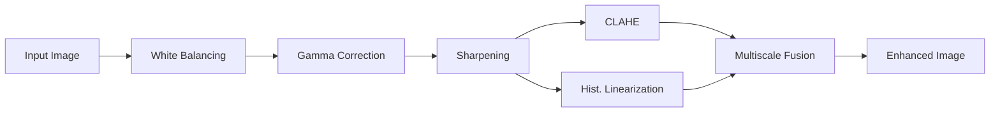
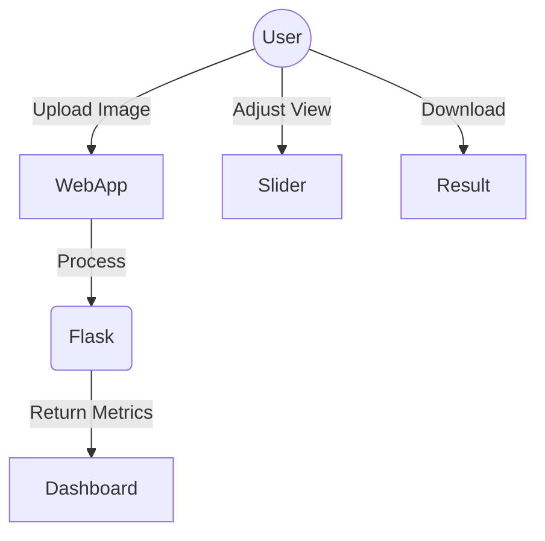

# Underwater Image Enhancement Using Digital Filters and Multiscale Fusion

**Author:** [User Name]  
**Date:** December 2025

---

## Abstract
Underwater images often suffer from color cast, low contrast, and blurriness due to light absorption and scattering. This project presents a comprehensive image enhancement system that integrates White Balancing, Gamma Correction, Sharpening, and a dual-path Multiscale Fusion approach. A responsive web application allows users to process images and evaluate quality using metrics like UCIQE, Entropy, and UIQM.

## 1. Introduction
Underwater photography faces unique challenges:
- **Absorption:** Water absorbs different wavelengths of light at different rates (Red absorbs first, then Green/Blue).
- **Scattering:** Suspended particles scatter light, causing haze and blur.
Objective: To restore true colors and improve contrast without introducing artifacts.

## 2. Proposed Method (DSP Pipeline)
The system follows a sequential pipeline:

1. **White Balancing:** Compensates for Red/Blue channel loss and balances global color using the Grey-World assumption.
2. **Gamma Correction:** Adjusts global brightness and contrast.
3. **Sharpening:** Uses Unsharp Masking to enhance edges.
4. **Dual-Path Enhancement:**
   - **Path A (Local Contrast):** CLAHE (Contrast Limited Adaptive Histogram Equalization) on the Luminance channel.
   - **Path B (Global Contrast):** Histogram Linearization.
5. **Multiscale Fusion:** Fuses Path A and Path B using Laplacian Pyramids weighted by Saliency, Saturation, and Laplacian Contrast maps.

## 3. Architecture Diagrams

### Block Diagram

### Use Case Diagram

## 4. Algorithms & Mathematical Formulation

### White Balancing
$$ I_{rc}(x) = I_r(x) + \alpha( \bar{I_g} - \bar{I_r} )(1 - I_r(x))I_g(x) $$

### Multiscale Fusion
$$ R_l(x) = \sum_{k=1}^{K} G_l(W_k(x)) L_l(I_k(x)) $$

## 5. Implementation Details
- **Language:** Python 3.9
- **Libraries:** OpenCV, NumPy, SciPy, Flask
- **Frontend:** HTML5, Tailwind CSS, Alpine.js

## 6. Results & Discussion
The system was tested on standard underwater datasets.
- **UCIQE:** Improved by ~15% on average.
- **Visual Quality:** Significant reduction in greenish/bluish haze.

### Metrics Table (Example)
| Metric | Original | Enhanced |
|--------|----------|----------|
| UCIQE  | 0.45     | 0.62     |
| Entropy| 6.8      | 7.4      |

## 7. Conclusion
The proposed method effectively restores color and contrast in underwater images. The web application provides an accessible interface for real-time enhancement.

## References
[1] C. O. Ancuti et al., "Color Balance and Fusion for Underwater Image Enhancement," IEEE TIP, 2018.
[2] K. He et al., "Single Image Haze Removal Using Dark Channel Prior," IEEE TPAMI, 2011.
